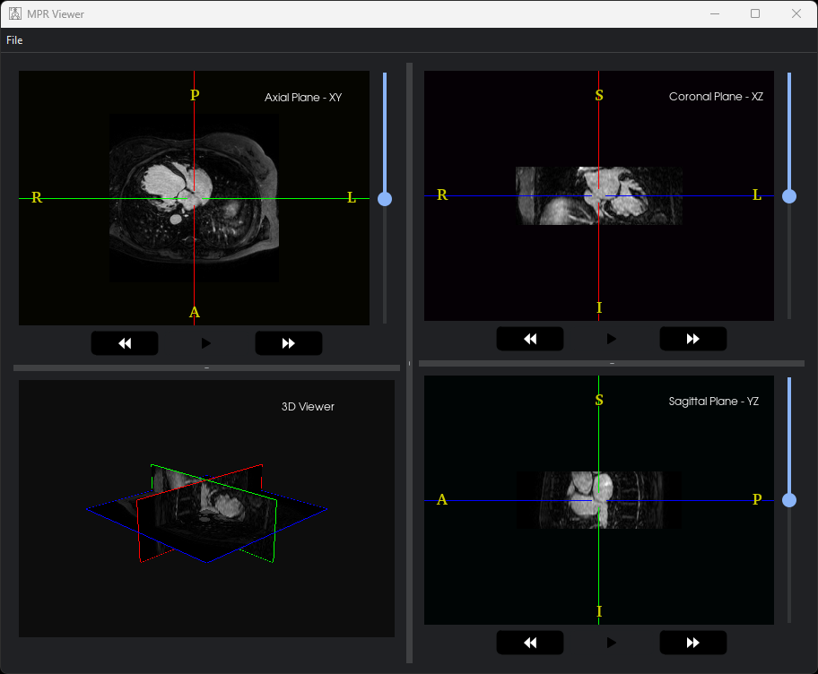
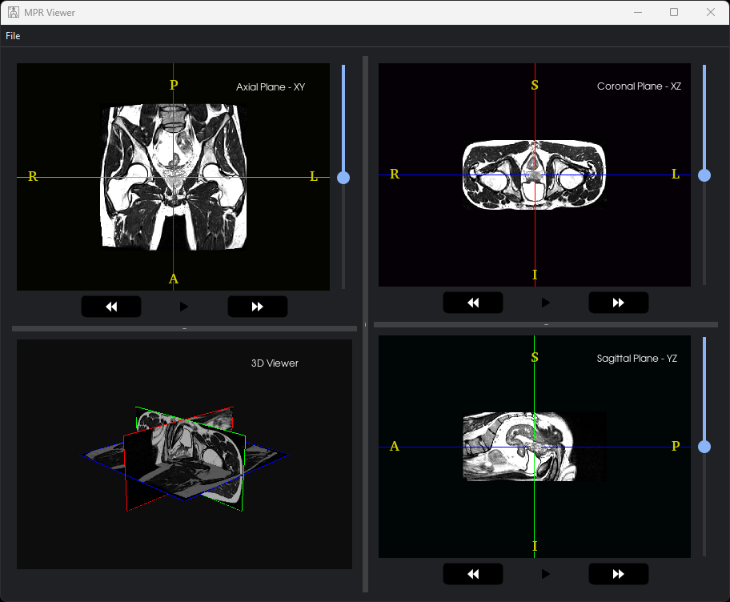

# MPR Viewer


> A multi-planar reconstruction (MPR) program renders medical data in multiple planes with different features.

---

### Table of Contents

- [Description](#description)
- [How To Use](#how-to-use)
- [Preview](#preview)
- [References](#references)

---

## Description

#### Features

- Open a medical data in (.mhd & .raw) format.
-Zoom (in-out) using the mouse.
- Scroll through slices in each view.
- Cine play/pause/stop in any viewer.
- Cine can run in multiple viewers simultaneously.
- Indicate each slice on the other planar viewers.
- Brightness-contrast control using the mouse.
- Ability to maximize each viewer and restore it.
- Ability to resize each viewer and swap them.

#### Technologies

- Python
- PyQt5
- VTK

[Back To The Top](#mpr-viewer)

---

## How To Use

#### Installation

```Terminal
$ pip install -r requirements.txt
```

#### Run Locally
Run python3 main.py in the terminal.
```Terminal
$ python3 main.py
```

[Back To The Top](#mpr-viewer)

---

## Preview






[Back To The Top](#mpr-viewer)

---

## References

- [VTK](https://vtk.org/)
- [PyQt5](https://pypi.org/project/PyQt5/)


[Back To The Top](#mpr-viewer)

---
